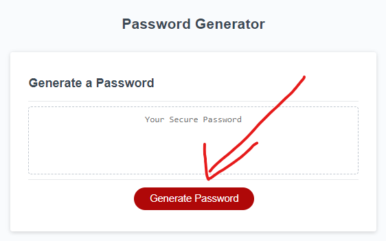
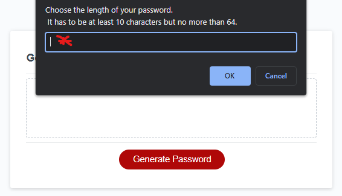
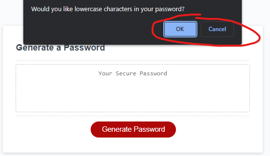
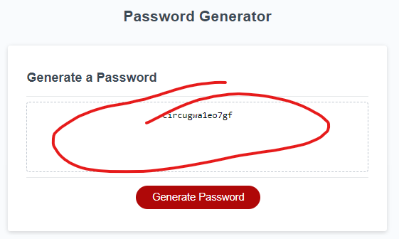

# Password-Generator

## Description

The purpose of this project is to create a password generator application, and at the same time apply some of the javascript recent studied knowledge.
This application consists in 3 basic steps, choosing the length of the password, choosing the character types, then visualizing the auto generated password.

## installation

N/A

## Usage

- Initiate by selecting the option "Generate password".  
  

- Choose the length of your password.  
  

- Select the character types.  
  

- At the end you will have a randomly generated password.  
  

## Credits

N/A

## License

Available under the MIT license. See the LICENSE file for more info.

## Test

[Deployed application](https://guilhermederetti.github.io/Password-Generator/)
